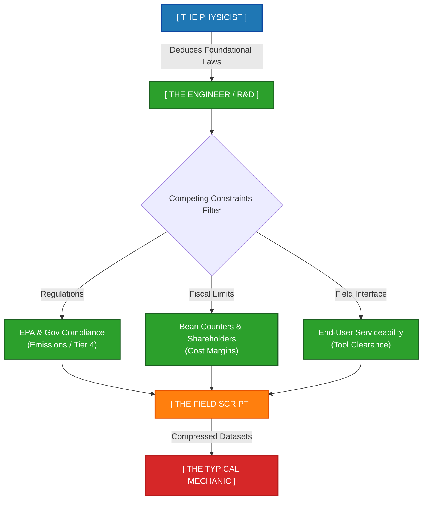

# Engineer-to-Mechanic-

```mermaid
graph TD
    %% Define Styles
    classDef macro fill:#1f77b4,stroke:#0d47a1,stroke-width:2px,color:#fff;
    classDef mid fill:#2ca02c,stroke:#1b5e20,stroke-width:2px,color:#fff;
    classDef script fill:#ff7f0e,stroke:#e65100,stroke-width:2px,color:#fff;
    classDef micro fill:#d62728,stroke:#b71c1c,stroke-width:2px,color:#fff;

    %% Flow Architecture
    A["[ THE PHYSICIST ]"] -->|Deduces Foundational Laws| B["[ THE ENGINEER / R&D ]"]
    
    B --> C{"Competing Constraints Filter"}
    C -->|Regulations| C1["EPA & Gov Compliance<br>(Emissions / Tier 4)"]
    C -->|Fiscal Limits| C2["Bean Counters & Shareholders<br>(Cost Margins)"]
    C -->|Field Interface| C3["End-User Serviceability<br>(Tool Clearance)"]
    
    C1 & C2 & C3 --> D["[ THE FIELD SCRIPT ]"]
    D -->|Compressed Datasets| E["[ THE TYPICAL MECHANIC ]"]

    %% Apply Styles
    class A macro;
    class B,C1,C2,C3 mid;
    class D script;
    class E micro;
```
